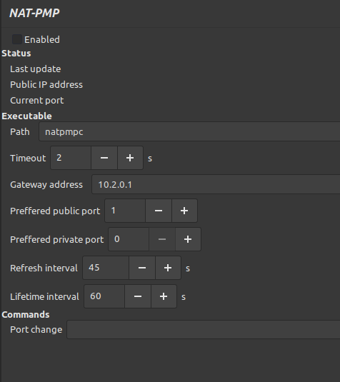

# Deluge NAT-PMP plugin

Deluge plugin for using `natpmpc` util to open port (via VPN connction probably).

Settings:

- *enabled* - enable plugin background process (so it actually starts working) 
- *timeout* - executable execution timeout in seconds
- *gateway address* - IP address of the gateway, where natpmpc needs to send requests
- *preffered public port* - preferred public TCP/UDP port
- *preffered private port* - preffered private TCP/UDP port
- *refresh interval* - frequency of execution of *natpmpc*
- *lifetime interval* - lifetime of request
- *port change* - path to script which is called when port changes




Current issues:

- not tested on Windows/Mac OS platform
- no indicator to show executable/path is invalid
- executable call is blocking (Deluge frozes if executable don't finish execution quickly), it needs to be moved into separate thread/process execution
- WebUI not correctly implemented

## Setup

```bash
# Install natpmpc util
apk add libnatpmp
```

## Build the plugin

```bash
python setup.py bdist_egg
```
